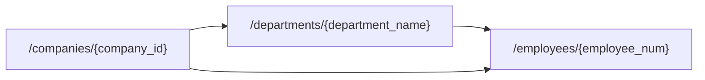

# OpenAPI Extensions for Client Generation

This document provides an overview of the OpenAPI extensions supported for API client generation. These extensions allow customization of client behavior and structure based on OpenAPI specifications. Note that the support for these extensions depends on the template used for client generation, as some templates may not implement or consider certain extensions.

## Top-Level Extensions

Top-level extensions are defined in the `info` section of the OpenAPI document and apply to the entire API specification. They can be used to configure client generation behavior or provide additional metadata.

### Template Configuration
The `x-apier.templates` field allows defining template-specific configurations at the top level of the OpenAPI document. These configurations depend on the template used for client generation and can include settings such as error handling or custom behaviors.

**Example:**
```yaml
info:
  x-apier:
    templates:
      python-tree:
        raise-response-errors: true
```

### Equivalent Paths Extension
The `x-apier.equivalent_paths` extension maps equivalent paths in the OpenAPI specification to simplify client generation. This is particularly useful for templates that generate clients with hierarchical method structures, such as the `python-tree` template.

This extension allows multiple paths that point to the same resource or operation to be unified in the generated client. By mapping a `source` path to a `target` path, the client can optimize its internal structure while handling both paths uniformly.

While this use case may be uncommon, it can be useful when an API has multiple endpoints representing the same resource or operation with different URL structures.

#### Example
In the example below, the `source` path `/companies/{company_id}/departments/{department_name}/employees/{employee_num}` is mapped to the `target` path `/companies/{company_id}/employees/{employee_num}`. Both paths access the same resource (an employee within a company), but the `target` path is preferred for client generation.

```yaml
info:
  x-apier:
    equivalent_paths:
      - source: /companies/{company_id}/departments/{department_name}/employees/{employee_num}
        target: /companies/{company_id}/employees/{employee_num}
```

The `source` path will match any path that starts with the specified prefix. For example, a longer path like `/companies/{company_id}/departments/{department_name}/employees/{employee_num}/details` will be treated as equivalent to `/companies/{company_id}/employees/{employee_num}/details`.

This mapping ensures that operations defined under the `source` path are treated as if they were defined under the `target` path. While the client interface remains unchanged, the internal structure is optimized to avoid redundancy and improve maintainability.

A graphical representation of this mapping can be visualized as a directed graph illustrating the relationships between endpoint layers:


## Operation-Level Extensions

These extensions are defined within the `paths` section of the OpenAPI document and apply to specific operations. These extensions can modify how individual operations are handled in the generated client.

### Pagination Extension
The `x-apier.pagination` extension enables handling of paginated endpoints in generated clients. It supports various pagination strategies, such as cursor-based and next-page URL pagination. For detailed documentation, refer to [Pagination Extension](./pagination.md).

**Example:**
```yaml
paths:
  /pagination/cursor:
    get:
      x-apier:
        pagination:
          next:
            reuse-previous-request: true
            modifiers:
              - param: "$request.query.next"
                value: "$response.body#/cursors/next"
            result: "results"
            has_more: "$response.body#/cursors/next"
```

### Method Name Extension
The `x-apier.method-name` extension allows customization of method names for operations in generated clients. It supports:
- **Default Method Name**: A generic name for the operation, used when no specific template is defined. This name will follow the naming conventions of the chosen template (e.g., `Create Company` may be converted to `create_company` in Python).
- **Template-specific Method Name**: Allows defining different method names depending on the template used.

**Example:**
```yaml
paths:
  /companies:
    post:
      x-apier:
        method-name:
          default: Create Company
          templates:
            python-tree: create  # python-tree template will create a `create()` method for this operation
            go: Create           # go template will create a `Create()` method for this operation
```

### Input Parameters Extension
The `x-apier.input-parameters` extension enables custom input parameters for operations. It allows defining additional parameters and constructing the request body using a payload template.

**Example:**
```yaml
paths:
  /tests/{company_id}/employees:
    post:
      x-apier:
        input-parameters:
          parameters:
            - name: employee_id
              description: ID of the employee.
              schema:
                type: integer
            - name: employee_name
              schema:
                type: string
            - name: extra_info
          payload: '{"number": {{employee_id}}, "name": "{{employee_name}}", "extra": {{extra_info | json}}}'
```

The `input-parameters` extension lets you define parameters (`employee_id`, `employee_name`, and `extra_info`) and build a custom payload using them, avoiding the need to pass the entire schema object as input. This makes the client methods more customizable and user-friendly.

By default, a template might generate a method requiring a full schema object:
```python
client.create_employee({
    "number": 123,
    "name": "John Doe",
    "extra": {"role": "developer"}
})
```

With the input-parameters extension, you can call the method using individual parameters:
```python
client.create_employee(employee_id=123, employee_name="John Doe", extra_info={"role": "developer"})
```

## Template Support

The table below indicates the support of each built-in template for the described extensions.

| Extension                | python-tree |
|--------------------------|-------------|
| Pagination               | Yes         |
| Method Name              | Yes         |
| Equivalent Paths         | Yes         |
| Input Parameters         | Yes         |
| Template Configuration   | Yes         |

For more details on templates, refer to the [Templates Documentation](../templates/README.md).
